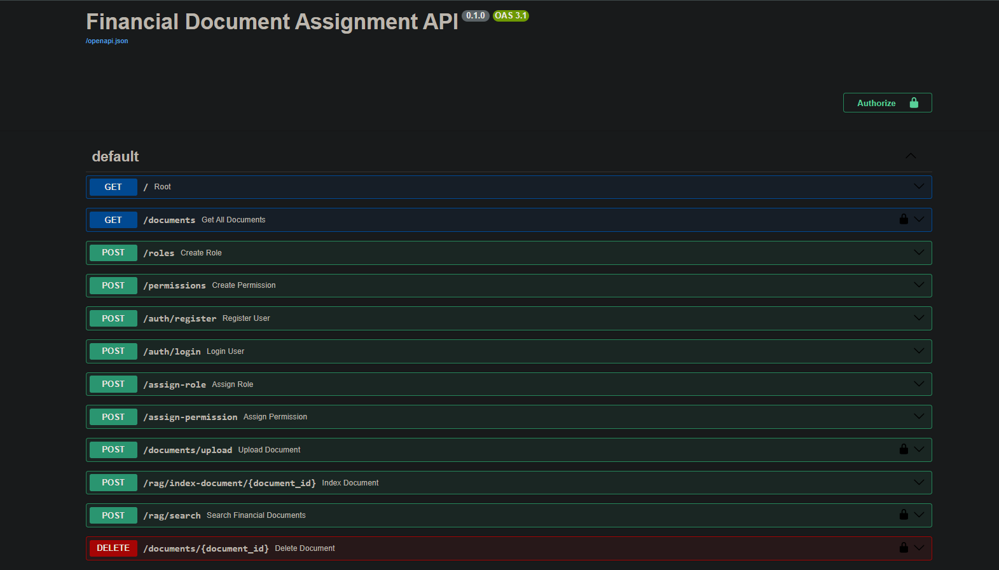
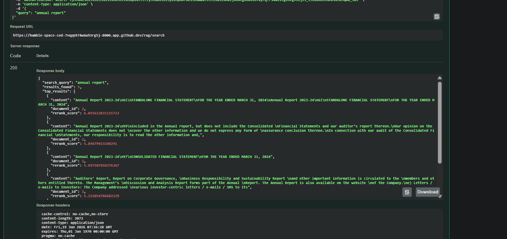

# Assignment-financial-rag
Assignment by Rohit Bhogale

This is an set of Financial Document APIs where we can register user, then login and get jwt token so to authorize yourself to upload document and then index it into vector DB and then finally find the reranked chunks which are revelant to query. The project will give top 20 similar or revelant chunks of the query based on documents and then apply reranking to give top 5 similar chunks based on scores.

1. first we create user here , with username , email and password.

2. Then it will store this data of user in PostgreSQL(neon cloud provider)

3. Login with the username and password, we get an JWT token

4. You can upload document only after login and you need respective permissions for that suppose you are admin you get all permission , if yu are client you get view permission.

5. After uploading we have to index it with vectorDB

6. After we can give an query to the rag/search , which returns the top 5 chunks based on reranking scores.
we have used an sample 

